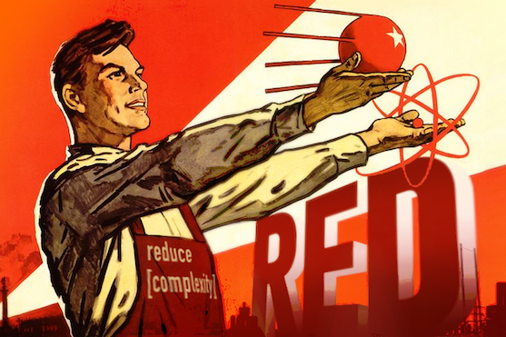

# RedCV Function Index

*Illustration by Fyodor Shchukin*

`All functions are documented in docs/RedCV_Manual.pdf
`
##Images and matrices basic operators
* **rcvCreateImage**: Creates and returns empty (black) image
* **rcvGetImageSize**: Gets image size as a pair
* **rcvGetImageFileSize**: Gets image file size as a pair
* **rcvCreateMat**: Creates 2D matrix
* **rcvLengthMat**: Returns matrix length
* **rcvMakeRangeMat**: Makes an ordered matrix
* **rcvMakeIndenticalMat**: Creates a matrix with identical values
* **rcvMakeBinaryMat**: Makes a [0 1] matrix
* **rcvReleaseImage**: Releases image data
* **rcvReleaseAllImages**: Releases all images
* **rcvReleaseMat**: Releases Matrix
* **rcvLoadImage**: Loads image from file
* **rcvLoadTiffImage**: Loads TIFF image
* **rcvReadTiffImageData**: Reads multiple images included in tiff file
* **rcvLoadImageAsBinary**: Loads image from file and return image as binary
* **rcvSaveImage**: Save image to file
* **rcvSaveTiffImage**: Save red image as tiff
* **rcvCloneImage**: Returns a copy of source image
* **rcvCloneMat**: Returns a copy of source matrix
* **rcvCopyImage**: Copy source image to destination image
* **rcvCopyMat**: Copy source matrix to destination matrix
* **rcvZeroImage**: Set all image pixels to 0
* **rcvRandomImage**: Creates a random uniform color or pixel random image
* **rcvRandomMat**: Randomize matrix
* **rcvImageNoise**: Add Gaussian noise on image
* **rcvColorImage**: Set image color
* **rcvColorMat**: Set matrix color
* **rcvSortMat**: Ascending sort of matrix
* **rcvFlipMat**: Flip matrix
* **rcvCompressRGB**: Zlib compression of image data
* **rcvDecompressRGB**: ZLib decompression of image data

##Image and matrix utilities
* **rcvIsAPixel**: Returns true if  pixel value is greater than threshold
* **rcvGetPixel**: Returns pixel value at xy coordinates
* **rcvPickPixel**: Returns pixel value at xy coordinates
* **rcvGetPixelAsInteger**: Returns pixel value at xy coordinates as integer
* **rcvGetInt2D** : Get integer matrix value
* **rcvGetReal2D**: Get float matrix value
* **rcvSetPixel**: Set pixel value at xy coordinates
* **rcvPokePixel**: Set pixel value at xy coordinates
* **rcvSetInt2D**: Set value in integer matrix 
* **rcvSetReal2D**: Set value in float matrix
* **rcvMatleftPixel**: Gets coordinates of first left pixel 
* **rcvMatRightPixel**: Gets coordinates of first right pixel
* **rcvMatUpPixel**: Gets coordinates of first top pixel
* **rcvMatDownPixel**:Gets coordinates of first bottom pixel
* **rcvSetAlpha**: Set image transparency
* **rcvBlend**: Computes the alpha blending of two images 
* **rcvBlendMat**: Computes the alpha blending of two matrices

##Format conversion
* **rcvImage2Mat**: Converts Red Image to integer 2-D Matrix
* **rcvMat2Image**: Integer [8, 16 or 32-bit] Matrix to Red Image
* **rcvConvertMatScale**: Converts matrix scale to another bit size
* **rcvMatInt2Float**: Converts integer matrix to Float [0..1] matrix
* **rcvMatFloat2Int**: Converts float matrix to integer [0..255] matrix
* **rcvSplit**: Separates source image in RGBA channels
* **rcvMerge**: Combines 3 images to a destination image
* **rcvSplit2Mat**: Splits an image to 4 8-bit matrices
* **rcvMerge2Image**: Merges 4 8-bit matrices to image
* **rcvTiff2RedImage**: Converts TIFF image to Red image 

##Color and color space conversion
* **rcvInvert**: Destination image: inverted source image 
* **rcv2NzRGB**: Normalizes the RGB values of an image
* **rcv2BW**: Convert RGB image to Black[0] and White [255]
* **rcv2WB**: Convert RGB image to White[255] and Black [0]
* **rcv2Gray**: Convert RGB image to Grayscale
* **rcv2BGRA**: Converts RGBA to BGRA
* **rcv2RGBA**: Converts BGRA to RGBA 
* **rcvRGB2HSV**: RBG color to HSV conversion
* **rcvBGR2HSV**: BGR color to HSV conversion
* **rcvRGB2HLS**: RBG color to HLS conversion
* **rcvBGR2HLS**: RBG color to HLS conversion
* **rcvRGB2YCrCb**: RBG color to YCrCb conversion
* **rcvBGR2YCrCb**: BGR color to YCrCb conversion
* **rcvRGB2XYZ**: RGB to CIE XYZ color conversion
* **rcvBGR2XYZ**: BGR to CIE XYZ color conversion
* **rcvRGB2Lab**: RBG color to CIE L*a*b conversion
* **rcvRGB2Lab**: RBG color to CIE L*a*b conversion
* **rcvRGB2Luv**: RBG color to CIE L*u*v conversion
* **rcvRGB2Luv**: RBG color to CIE L*u*v conversion
* **rcvIRgBy**: Log-opponent conversion

##Arithmetic operators
* **rcvAdd**: Destination image: image 1 + image 2
* **rcvAddMat**:  Destination matrix: matrix 1 + matrix 2
* **rcvAddLIP**: Destination image: image 1 + image 2 (Logarithmic Image Processing 
* **rcvSub**: Destination image: image 1 - image 2
* **rcvSubMat**: Destination matrix: matrix 1 - matrix 2
* **rcvSubLIP**: Destination image: image 1 - image 2 (Logarithmic Image Processing 
* **rcvMul**: Destination image: image 1 * image 2
* **rcvMulMat**: Destination matrix: matrix 1 * matrix 2
* **rcvDiv**: Destination image: image 1 / image 2
* **rcvDivMat**: Destination matrix: matrix 1 / matrix 2
* **rcvMod**: Destination image: image 1 // image 2 (modulo)
* **rcvRem**: Destination image: image 1 % image 2 (remainder)
* **rcvRemMat**: Destination matrix: matrix 1 % matrix 2
* **rcvAbsDiff**: Absolute difference image 1 - image 2
* **rcvMIN**: Minimum value image1/image2
* **rcvMAX**: Minimum value image1/image2
* **rcvLSH**: Left shift on image
* **rcvRSH**: Right shift on image
* **rcvPow**: Computes nth power of an image 
* **rcvSQR**: Computes square root of image
* *exp*: **To Be Done requires float images**
* *log*: **To Be Done requires float images**
* **rcvMeanImages**: Destination image: (image 1 + image 2) / 2
* **rcvMeanMats**: Destination matrix: (matrix 1 + matrix 2) / 2
* **rcvAddS**: Adds scalar (integer) to image
* **rcvAddSMat**: AAdds scalar (integer)to matrix
* **rcvAddT**: Adds scalar (tuple) to image
* **rcvSubS**: Substracts scalar (integer) to image
* **rcvSubSMat**: Substracts scalar (integer) to matrix
* **rcvSubT**: Substracts scalar (tuple) to image
* **rcvMulS**: Multiplies image by scalar (integer)
* **rcvMulT**: Multiplies image by scalar (tuple)
* **rcvMulSMat**: *Multiplies matrix by scalar (integer)*
* **rcvDivS**: Divides image by scalar (integer)
* **rcvDivT**: Divides image by scalar (tuple)
* **rcvDivSMat**: Divides matrix by scalar (integer)
* **rcvModS** : Modulo on image by integer
* **rcvModT**: Modulo on image by tuple
* **rcvRemS**: Remainder image by integer
* **rcvRemT**: Remainder image by tuple
* **rcvRemSMat**: Remainder matrix by scalar

##Logic operators
* **rcvAND**: Destimation image: image 1 AND image 2
* **rcvANDMat**: Destimation matrix: matrix 1 AND matrix 2
* **rcvOR**: Destimation image: image 1 OR image 2
* **rcvORMat**: Destimation matrix: matrix 1 OR matrix 2
* **rcvXOR**: Destimation image: image 1 XOR image 2
* **rcvXORMat**: Destimation matrix: matrix 1 XOR matrix 2
* **rcvNAND**: Destimation image: image 1 NAND image 2 
* **rcvNOR**: Destimation image: image 1 NOR image 2
* **rcvNXOR**: Destimation image: image 1 NXOR image 2
* **rcvNOT**: Destimation image: image 1 NOT image 2
* **rcvANDS**: Tuple value is use to create a colored image which is ANDed to source image
* **rcvORS**: Tuple value is use to create a colored image which is ORed to source image
* **rcvXORS**:Tuple value is use to create a colored image which is XORed to source image
* **rcvANDSMat**: And integer value to all elements in source matrix
* **rcvORSMat**: OR integer value to all elements in source matrix
* **rcvXORSMat**: XOR integer value to all elements in source matrix

##Statistics and image features extraction
* **rcvCountNonZero**: Returns number of non zero values in image or matrix
* **rcvSum**: Returns sum value of image or matrix as a block of rgb values
* **rcvSumMat**: returns matrix sum as number value
* **rcvMean**: Returns mean value of image or matrix as a tuple of rgb values
* **rcvMeanMat**: returns matrix mean as a number
* **rcvSTD**: Returns standard deviation value of image or matrix as a block of rgb values
* **rcvMedian**: Returns median value of image or matrix as a block of rgb values
* **rcvProdMat**: return matrix product
* **rcvMinValue**: Returns minimal value of image or matrix as a block of rgb values
* **rcvMaxValue**: Returns maximum value of image or matrix as a block of rgb values
* **rcvMaxMat**: maximum of matrix as a number
* **rcvMinMat**: minimum  of matrix as a number
* **rcvMinLoc**: Finds global minimum location in array
* **rcvMaxLoc**: Finds global maximum location in array
* **rcvRangeImage**: Gives range value in Image as a tuple
* **rcvGetMatCentroid**: Returns the centroid of the image
* **rcvGetMatSpatialMoment**: Returns the spatial moment of the mat
* **rcvGetMatCentralMoment**: Returns the central moment of the mat
* **rcvGetNormalizedCentralMoment**: Return the scale invariant moment of the image
* **rcvGetMatHuMoments**: Returns Hu momoent of the image
* **rcvSortImage**: Ascending image sorting
* **rcvXSortImage**: Image sorting by line
* **rcvYSortImage**: Image sorting by column
* **rcvHistogram**: Calculates array histogram
* **rcvRGBHistogram**: Calculates array histogram according to the number of bins
* **rcvMeanShift**: Uses histograms to calculate Mean Shift processing
* **rcvSmoothHistogram**: This function smoothes the input histogram by a moving average
* **rcvIntegral**: Calculates integral images
* **rcvQuickHull**: Finds the convex hull of a point set
* **rcvContourArea**: Calculates the area of polygon generated by rcvQuickHull function

##Geometrical transformations
Using Draw DSL

* **rcvFlip**: Left/Right, Up/Down or both directions image flip
* **rcvResizeImage**: Resizes image and applies filter for Gaussian pyramidal up or downsizing if required
* **rcvScaleImage**: Sets the scale factors: Returns a Draw block 
* **rcvTranslateImage**: Sets the origin for drawing commands : Returns a Draw block 
* **rcvRotateImage**: Sets the clockwise rotation about a given point, in degrees : Returns a Draw block
* **rcvSkewImage**: Sets a coordinate system skewed from the original by the given number of degrees

Using RedCV Routines
## Distances functions
* **rcvNSquareRoot:**: Returns the nth root of Num
* **rcvGetEuclidianDistance**: Gets Euclidian distance between 2 points
* **rcvGetManhattanDistance**: Gets Manhattan distance between 2 points
* **rcvGetChebyshevDistance**: Gets Chebyshev distance between 2 points
* **rcvGetMinkowskiDistance**: Gets Minkowski distance between 2 points
* **rcvGetCamberraDistance**:Gets Camberra distance between 2 points
* **rcvGetSorensenDistance**: Gets Sorensen or Bray Curtis distance between 2 points
* **rcvDistance2Color**: "Returns tuple value modified by distance
* **rcvGetAngle**: Gets angle in degrees from points coordinates
* **rcvGetAngleRadian**: Gets angle in radian
* **rcvRhoNormalization**: Returns a normalized block [0.0..1.0] of distance values.
* * **rcvVoronoiDiagram**: Creates Voronoï diagram
* **rcvDistanceDiagram**: Creates Distance diagram
* **rcvMakeGradient**: Makes a gradient matrix for contour detection (similar to Sobel) and returns max gradient value
* **rcvMakeBinaryGradient**: Makes a binary [0 1] matrix for contour detection
* **rcvFlowMat**: Calculates the distance map to binarized gradient
* **rcvnormalizeFlow**: Normalizes distance into 0..255 range according to scale value
* **rcvGradient&Flow**: Creates an image including flow and gradient values
* **rcvChamferDistance**: Selects a pre-defined chamfer kernel
* **rcvChamferCreateOutput**: Creates a distance map (float!) 
* **rcvChamferInitMap**: Initializes distance map 
* **rcvChamferCompute**: Calculates the distance map to binarized gradient
* **rcvChamferNormalize**: Normalizes calculated distance map
* **rcvKMInitData**: Creates data or centroid array for k-means
* **rcvKMGenCentroid**: Generates centroids initial values
* **rcvKMInit**: k-means first initialization
* **rcvKMCompute**: Lloyd k-means clustering with convergence

##Image enhancement
* **rcvMakeTranscodageTable**: Creates a transcoding 256 table for affine enhancement
* **rcvContrastAffine**: Enhances image contrast with affine function
* **rcvHistogramEqualization**: This function performs histogram equalization on the input image array

##Thresholding
* **rcv2BWFilter**: Binarization of RGB image according to threshold value
* **rcvThreshold**: Applies fixed-level threshold to array elements. Images are processed as grayscale
* **rcvInRange**: Extracts sub array from image according to lower and upper rgb values
* **rcvInRangeMat**: Extracts sub array from matrix according to lower and upper values

##Spatial filtering
* **rcvMakeGaussian**: Creates a Gaussian uneven kernel
* **rcvGaussianFilter**: Fast Gaussian 2D filter
* **rcvDoGFilter**: Difference of Gaussian
* **rcvConvolve**: Convolves an image with the kernel
* **rcvConvolveMat**: Convolves a 2-D matrix with the kernel
* **rcvConvolveNormalizedMat**: Convolves a normalized 2-D matrix with the kernel
* **rcvFastConvolve**: Convolves 8-bit and 1-channel image with the kernel
* **rcvFilter2D**: Basic convolution filter
* **rcvFastFilter2D**: Fast convolution filter
* **rcvPointDetector**: Convolution allowing to find dots in image or matrix

## Fast edge detection
* **rcvSobel**: Direct Sobel edges detection for image or matrix
* **rcvRoberts**: Robert's cross edges detection for image or matrix
* **rcvPrewitt**: Computes an approximation of the gradient magnitude of the input image
* **rcvGradientMasks**: Fast gradient mask filter
* **rcvKirsch**: Computes an approximation of the gradient magnitude of the input image
* **rcvGradNeumann**: Computes the discrete gradient by forward finite differences and Neumann boundary conditions
* **rcvDivNeumann**: Computes the divergence by backward finite differences 
* **rcvDerivative2**: Computes an approximation of the gradient magnitude of the input image 
* **rcvLaplacian**: Computes the Laplacian of an image or matrix. The Laplacian is an approximation of the second derivative of an image 
* **rcvDiscreteLaplacian**: Discrete Laplacian Filter
* **rcvRobinson**: Robinson filter
* **rcvLaplacianOfRobinson**: Laplacian of Robinson filter
* **rcvEdgesGradient**: Image gradients with hypot function
* **rcvEdgesDirection**: Angles in degrees with atan2 functions
* **rcvEdgesSuppress**: Non-maximum suppression
* **rcvDoubleThresh**: Double thresholding
* **rcvHysteresis**: non-maximum suppression to thin out the edge
 
## Lines detection
* **rcvMakeHoughAccumulator**: Creates Hough accumulator
* **rcvGetAccumulatorSize**: Gets Hough space accumulator size
* **rcvHoughTransform**: Makes Hough transform
* **rcvGetHoughLines**: Gets lines in the accumulator according to threshold
* **rcvHough2Image**: Makes Hough space as red image
* **rcvLineDetection**: fast line detection 

## Shape detection
* **rcvMatGetBorder**: TBD
* **rcvMatGetChainCode**: TBD

##Mathematical morphology
* **rcvCreateStructuringElement**: The function allocates and fills a block, which can be used as a structuring element in the morphological operations
* **rcvErode**: Erodes image by using structuring element
* **rcvErodeMat**: Erodes matrice by using structuring element
* **rcvDilate**: Dilates image by using structuring element
* **rcvDilateMat**: Dilates matrice by using structuring element
* **rcvOpen**: Erodes and Dilates image by using structuring element
* **rcvClose**: Dilates and Erodes image by using structuring element
* **rcvMGradient**: Performs advanced morphological transformations using erosion and dilatation 
* **rcvTopHat**: Performs advanced morphological transformations
* **rcvBlackHat**: Performs advanced morphological transformations
* **rcvMMean**: Means image by using structuring element

## Image denoising
* **rcvMeanFilter**: Mean Filter for images
* **rcvMedianFilter**: Median Filter for images
* **rcvMinFilter**: Minimum Filter for images
* **rcvMaxFilter**: Maximum Filter for images
* **rcvMidPointFilter**: Midpoint Filter for image

## 1-D series filtering
* **rcvTSCopySignal**: Makes a copy of original signal
* **rcvTSStatSignal**: Return mean, sd, minimal and maximal values of the signal serie
* **rcvTSSDetrendSignal**: Removes linear trend in the signal by removing mean value of the serie
* **rcvTSSNormalizeSignal**: Normalize data by replacing each value by a normalized value
* **rcvTSMMFilter**: Calculates a mobile mean  according to the number of points given by filterSize
* **rcvSGFilter**: Calculates second order polynomial Savitzky-Golay filter
* **rcvSGCubicFilter**: Calculates cubic polynomial Savitzky-Golay filter
* **rcvSGQuarticFilter**: Calculates quartic polynomial Savitzky-Golay filter
* **rcvSGDerivative1**: Calculates first derivative polynomial Savitzky-Golay filter

## Dynamic Time Warping
* **rcvDTWDistances**: Making a 2d matrix to compute distances between all pairs of x and y series
* **rcvDTWRun**: Making a 2d matrix to compute minimal distance cost
* **rcvDTWGetDTW**: Returns DTW value
* **rcvDTWGetPath**: Find the path minimizing the distance 
* **rcvDTWCompute**: Short-cut to get DTW value if you don't need distance and cost matrices

##GUI functions
* **rcvNamedWindow**: Creates a window
* **rcvDestroyWindow**: Destroys a created window
* **rcvDestroyAllWindows**: Destroys all windows
* **rcvResizeWindow**: Sets window size
* **rcvMoveWindow**: Sets window position
* **rcvShowImage**: Shows image in window

##Random generator
* **randFloat**: Returns a decimal value beween 0 and 1. Base 16 bit
* **randf**: routine similar to randFloat for faster computation
* **randUnif**: Uniform law 
* **randExp**: Exponential law
* **randExpm**: Exponential law with a l degree
* **randNorm**: Normal law 
* **randLognorm**: Lognormal law
* **randGamma**: Gamma law
* **randDisc**: Geometric law in a disc
* **randRect**: Geometric law in a rectangle
* **randChi2**: Chi square law 
* **randErlang**: Erlang law 
* **randStudent**: Student law 
* **randFischer**: Fisher law
* **randLaplace**: Laplace law 
* **randBeta**: Beta law 
* **randWeibull**: Weibull law 
* **randRayleigh**: Rayleigh law
* **randBernouilli**: Bernouilli law
* **randBinomial**: Binomial law
* **randBinomialneg**: Binomial negative law 
* **randGeo**: Geometric law
* **randPoisson**: Poisson law 

## Misc routines and functions
* **minInt**: integer minimun value 
* **minFloat**: float minimum value
* **maxInt**: min float value
* **maxFloat**: max float value
* **rcvElapsed**: time in ms between 2 events
* **rcvRound**: rounding function
* **rcvHypot**: calculate the length of the hypotenuse of a right-angle triangle

